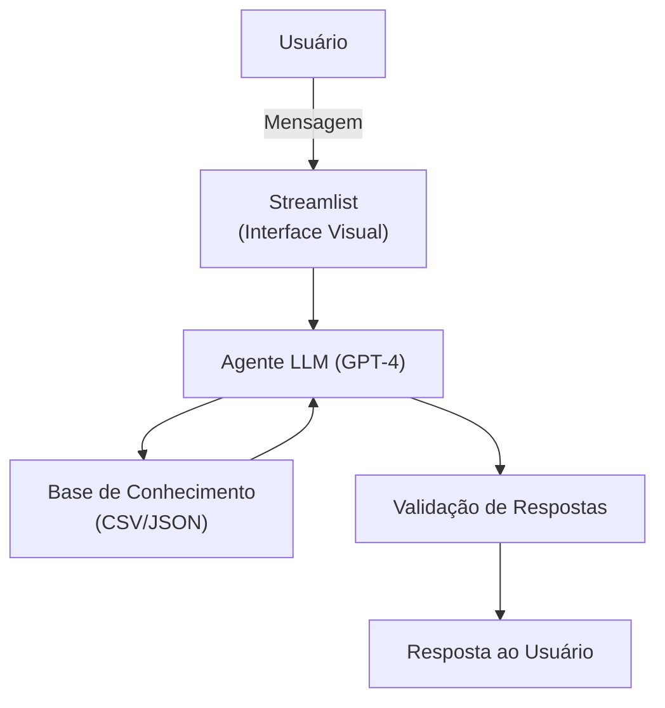

# 🤖 FinData AI: Agente Financeiro Inteligente

## Resumo do Projeto

O FinData AI é um agente financeiro inteligente focado em educação financeira e análise de dados.
Ele foi desenvolvido para ajudar usuários a entender, organizar e melhorar sua vida financeira de forma proativa e baseada em dados reais, combinando análise de transações, perfil de investidor e histórico de atendimento.

Problema resolvido: Muitas pessoas têm dificuldade em compreender conceitos financeiros, como gestão de gastos, reserva de emergência, tipos de investimentos e otimização de orçamento. O FinData AI atua como consultor e educador financeiro, fornecendo insights claros e recomendações personalizadas.

Público-alvo: Usuários que desejam melhorar sua educação financeira e tomar decisões financeiras conscientes, com base em dados.

---

## ⚡ Funcionalidades Principais

- Análise de gastos: identifica padrões, aumentos ou reduções relevantes e destaca categorias com gastos excessivos.
- Recomendações personalizadas: sugere produtos financeiros adequados ao perfil do usuário.
- Insights financeiros: transforma dados brutos em recomendações práticas e educativas.
- Educação proativa: fornece explicações sobre conceitos financeiros e melhores práticas.
- Segurança e confiabilidade: evita alucinações, responde apenas com base em dados disponíveis e respeita o perfil do investidor.

---

## 🏗️ Arquitetura

O FinData AI possui uma arquitetura modular, garantindo flexibilidade, confiabilidade e escalabilidade:


### Componentes detalhados:

| Componente | Descrição |
|------------|-----------|
| Interface | Chatbot interativo em Streamlit para comunicação com o usuário (https://streamlit.io/) |
| LLM | Modelo de linguagem (ex: GPT via API ou Ollama (local) |
| Base de Conhecimento | Conjunto de dados mockados `(transações, perfil, histórico e produtos financeiros)` |
| Validação | Checagem de consistência e prevenção de respostas incorretas ou alucinações |

---

## 📊 Base de Dados

O agente utiliza dados mockados para simular clientes reais:

| Arquivo | Formato | Para que serve no FinData |
|---------|---------|---------------------|
| `transacoes.csv` | CSV | Histórico de transações do cliente, usado para análise de gastos |
| `historico_atendimento.csv` | CSV | Contextualiza interações anteriores do cliente |
| `perfil_investidor.json` | JSON | Define o perfil do cliente para personalização de recomendações |
| `produtos_financeiros.json` | JSON | Lista de produtos e serviços financeiros disponíveis para sugestão |

> Dados são carregados no início da sessão e consultados dinamicamente pelo agente, garantindo respostas confiáveis.

Exemplo - Perfil do Cliente

```json
{
  "nome": "João Silva",
  "idade": 32,
  "renda_mensal": 5000.00,
  "perfil_investidor": "moderado",
  "objetivo_principal": "Construir reserva de emergência",
  "metas": [
    {
      "meta": "Completar reserva de emergência",
      "valor_necessario": 15000.00,
      "prazo": "2026-06"
    },
    {
      "meta": "Entrada do apartamento",
      "valor_necessario": 50000.00,
      "prazo": "2027-12"
    }
  ]
}
```
### Como o Agente Utiliza Este JSON
**- Personalização de Recomendação:**
    O agente utiliza o perfil_investidor para sugerir investimentos compatíveis (ex: conservador, moderado, agressivo).
    
**- Definição de Prioridades Financeiras:**
    O campo objetivo_principal e a lista metas ajudam o agente a focar em alertas e sugestões que acelerem o alcance das metas do cliente.
    
**- Cálculos e Insights:**
    Com renda_mensal e metas, o agente pode calcular quanto o cliente deve poupar mensalmente, indicar ajustes no orçamento e gerar recomendações práticas.
    
**- Exemplo no Prompt:**
    Ao montar o contexto para o LLM, os dados podem ser incluídos assim:

```json
"DADOS_DO_CLIENTE": {
  "nome": "João Silva",
  "idade": 32,
  "perfil_investidor": "moderado",
  "renda_mensal": 5000.00,
  "metas": [
    {"meta": "Completar reserva de emergência", "valor_necessario": 15000.00, "prazo": "2026-06"}
  ]
}
```
> O agente lê esse JSON e gera respostas personalizadas, mantendo segurança e assertividade, sem inventar informações.


Exemplo - Transações do Cliente

```json
[
  {
    "data": "2026-03-01",
    "categoria": "Alimentação",
    "descricao": "Supermercado Extra",
    "valor": 450.00
  },
  {
    "data": "2026-03-03",
    "categoria": "Entretenimento",
    "descricao": "Assinatura Netflix",
    "valor": 55.00
  },
  {
    "data": "2026-03-05",
    "categoria": "Transporte",
    "descricao": "Combustível Posto Ipiranga",
    "valor": 200.00
  },
  {
    "data": "2026-03-10",
    "categoria": "Saúde",
    "descricao": "Consulta médica",
    "valor": 180.00
  },
  {
    "data": "2026-03-12",
    "categoria": "Educação",
    "descricao": "Curso Python Online",
    "valor": 120.00
  }
]
```
### Como o Agente Utiliza Este JSON
**- Análise de Padrões de Gastos:**
    O agente lê todas as transações e calcula totais por categoria, identificando aumentos ou reduções de gastos.
    
**- Insights Personalizados:**
    Ex.: “Seus gastos com alimentação aumentaram 15% em relação ao mês anterior. Sugiro revisar compras de supermercado ou delivery.”
    
**- Sugestões de Planejamento:**
    Baseado no histórico, o agente pode criar alertas de limite por categoria e indicar áreas de otimização do orçamento.
    
**- Exemplo no Prompt:**

```json
"TRANSACOES_CLIENTE": [
  {"data": "2026-03-01", "categoria": "Alimentação", "descricao": "Supermercado Extra", "valor": 450.00},
  {"data": "2026-03-03", "categoria": "Entretenimento", "descricao": "Assinatura Netflix", "valor": 55.00}
]
```
> Esse JSON vai direto para o contexto do LLM, garantindo que todas as respostas estejam baseadas em dados reais, evitando alucinações.

---

## 🚀 Como Rodar o Projeto
1. Clonar o repositório 
```bash
git clone https://github.com/seu-usuario/dio-lab-bia-do-futuro.git
cd dio-lab-bia-do-futuro/src
```
> 💡 Dica: Verifique se você tem o Python 3.10+ instalado. Recomenda-se criar um ambiente virtual antes de instalar as dependências:

2. Crie e ative um ambiente virtual:
```bash
python -m venv venv
source venv/bin/activate   # Linux/macOS
venv\Scripts\activate      # Windows
```


3. Instalar dependências
```bash
pip install -r src/requirements.txt
```

4. Executar aplicação
```bash
streamlit run src/app.py
```

4. Estrutura de código
```bash
📁 src/
    ├── app.py           # Aplicação principal (Streamlit)
    ├── agente.py        # Lógica do agente
    ├── config.py        # Configurações (API keys, etc.)
    └── requirements.txt # Dependências
```

---

## 💬 Exemplos de Uso

**Consulta de gastos:**

```
Usuário: "Quanto gastei com lazer?"
Resumo: R$ 450 em lazer no último mês
Insight: Esse aumento representa 30% acima do seu padrão habitual
Sugestão: Defina um limite mensal para lazer para equilibrar o orçamento
```
**Recomendação de investimento:**

```
Usuário: "Posso investir agora?"
Resumo: Perfil moderado, saldo disponível
Insight: Ainda não possui reserva de emergência
Sugestão: Estruture uma reserva de 3-6 meses antes de investir
```
**Dicas de otimização financeira:**

```
Usuário: "O que posso melhorar nas minhas finanças?"
Resumo: Alimentação é a maior despesa mensal
Insight: Representa mais de 40% dos gastos
Sugestão: Reduzir hábitos de delivery e refeições fora de casa
```

---

## 📏 Métricas de Avaliação

O FinData AI é avaliado com base em:

| Métrica | O que avalia | Exemplo |
|---------|---------|---------------------|
| Assertividade | Correção das respostas | Saldo retornado é o correto |
| Segurança | Evita alucinações | Responde apenas com dados disponíveis |
| Coerência | Compatibilidade com perfil | Recomendação de produto adequada ao perfil do investidor |

> Testes recomendados: colegas ou familiares avaliam respostas de 1 a 5 para cada métrica.

---

### Cenários de Teste
 
| # | Pergunta | Resultado Esperado |
|---|----------|-------------------|
| 1 | "Quanto gastei com alimentação?" | Valor correto do `transacoes.csv` |
| 2 | "Estou gastando muito?" | Identificação de padrões e possível aumento de gastos |
| 3 | "Qual investimento você recomenda?" | Sugestão alinhada ao perfil do investidor |
| 4 | "Qual o rendimento exato desse investimento?" | Agente informa que não possui essa informação |
 
> 📄 Documentação completa em [`docs/04-metricas.md`](./docs/04-metricas.md)
 
---

## ⚙️ Tecnologias

- LLM: GPT-4
- Interface: Streamlit
- Linguagem: Python
- Dados: CSV/JSON
- Orquestração: Python nativo, modularização de código

---

## 📜 Licença

MIT License – consulte o arquivo LICENSE para detalhes.

---

## 👨‍💻 Autor

### Lucas Fernandes

PCD auditivo, usuário de implante coclear e apaixonado por contábeis, tecnologia, dados e inteligência artificial.

Experiência em:

Dashboards Power BI/Looker Studio

FP&A/Engenharia de Dados/Analista de Dados

Automação de Processos/Projetos com IA

📍 Franca - SP

---

© 2026 Lucas Fernandes Todos os direitos reservados
